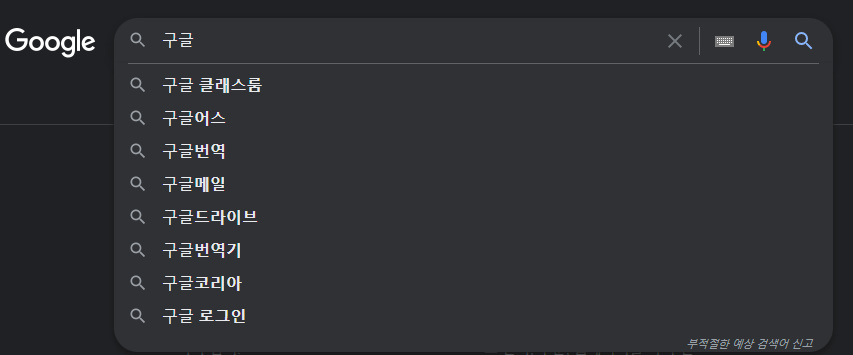

# 제이쿼리... 꼭 필요할까?

제이쿼리란 화면의 동적 기능을 자바스크립트보다 좀 더 쉽고 편리하게 개발할 수 있게 해주는 자바스크립트 기반 라이브러리이다.

제이쿼리는 자바스크립트의 복잡한 코드, 브라우저들의 호환성 문제로 등장했고 엄청난 인기를 얻었다.


하지만 현재 ES6, ES7, ES8로 자바스크립트로도 간편하고 멋진 코드를 작성할 수 있게 되었고,

브라우저들의 호환성 문제도 해결되면서 제이쿼리를 사용해야 할 이유가 줄어들었다.


그렇지만 새로 구축된 프로젝트가 아닌 이상 제이쿼리로 만들어진 프로젝트가 대다수이기 때문에 제이쿼리를 알아둘 필요는 있다.

다만 제이쿼리가 필요했던 이유들이 사라졌고, 제이쿼리를 자바스크립트가 충분히 대체할 수 있다는 점은 알아두자.


## 특징

- 메서드 체인 방식으로 수행하므로 여러 개의 동작이 한 줄로 나열되어 코드가 불필요하게 반복되는 것을 피할 수 있다.
- 풍부한 플러그인을 제공하므로 이미 개발된 많은 플러그인을 쉽고 빠르게 이용할 수 있다.
- 크로스 브라우징을 제공하므로 브라우저 종류에 상관 없이 동일하게 기능을 수행한다.


## 사용방법

1. 라이브러리를 직접 다운받아서 사용하는 방법
2. 네트워크로 CDN 호스트를 설정해서 사용하는 방법

```html
// 1번 방법
<script src="/파일경로/제이쿼리파일명.js"></script>

// 2번 방법 - 가장 최신의 버전 설치, 특정 버전을 설치하고 싶다면 latest 대신 원하는 버전을 입력하면 된다.
<script src="http://code.jquery.com/jquery-latest.min.js"></script>

```


## 기본 문법

실습을 하며 주로 썼던 문법들만 작성했다.

훨씬 더 많은 문법들이 있으니 구글링을 통해 알아보자.


### 직접 선택자

| 선택자 종류       | 선택자 표현 방법               | 설명                                     |
| ----------------- | ------------------------------ | ---------------------------------------- |
| All selector      | $("*")                         | 모든 DOM을 선택                          |
| Id selector       | $("#id")                       | 해당되는 아이디 이름을 가지는 DOM 선택   |
| Element selector  | $("elementName")               | 해당되는 이름을 가지는 DOM을 선택        |
| class selector    | $(".className")                | 해당되는 클래스 이름을 가지는 DOM 선택   |
| Multiple selector | $("selector1","selector2 ...") | 해당되는 선택자를 가지는 모든 DOM을 선택 |


### 메서드

#### 속성 조작 메서드

| 메서드 종류   | 사용법                                                     | 설명                                                         |
| ------------- | ---------------------------------------------------------- | ------------------------------------------------------------ |
| html()        | $("요소 선택").html(); <br />$("요소 선택").html(새 요소); | 선택한 요소의 하위 요소들을 반환하거나 새 요소로 변환        |
| toggleClass() | $("요소 선택").toggleClass("클래스 이름");                 | 선택한 요소에 지정한 클래스 값이 없을 경우 생성, 있을 경우 삭제 |
| val()         | $("요소 선택").val();<br />$("요소 선택").val(입력 값);    | 선택한 입력 요소의 value값을 반환하거나 입력한 값으로 변환   |


#### 이벤트 등록 메서드

| 구분       | 종류    | 설명                                                         |
| ---------- | ------- | ------------------------------------------------------------ |
| 로딩이벤트 | load()  | 선택한 이미지 또는 프레임 요소에 연동된 소스가 로딩이 완료된 후 이벤트 발생 |
| 로딩이벤트 | ready() | 지정한 html 문서 객체가 로딩이 완료된 후 이벤트 발생         |


## 제이쿼리 Ajax 기능

Ajax란 비동기 자바스크립트+XML의 의미로 자바스크립트를 이용한 비동기 통신,

클라이언트와 서버 간의 XML이나 JSON 데이터를 주고받는 기술을 의미한다.


### 특징

- 페이지 이동 없이 데이터 처리가 가능

- 서버의 처리를 기다리지 않고 비동기 요청이 가능


### Ajax를 사용하는 이유

간단하게 말하자면 웹페이지의 일부분에만 새로운 콘텐츠을 받아오기 위해서이다.

기본적으로 HTTP 프로토콜은 클라이언트쪽에서 Request를 보내고 서버쪽에서 Response를 받으면 이어졌던 연결이 끊기게 되어있다. 

그래서 페이지의 콘텐츠들을 새롭게 받아오기 위해서는 다시 request를 하고 response를 해서 페이지 전체를 갱신해야만 한다.


	

라이브 검색, 혹은 자동완성이라고 부르는 기능은 주로 ajax를 활용하는데,

Ajax가 없다면 검색어들을 받아올 때마다 페이지 전체를 갱신해야하므로 엄청난 시간과 자원 낭비가 일어날 것이다.


Ajax는 HTML 페이지 전체가 아닌 일부분만 갱신할 수 있도록 XMLHttpRequest객체를 통해 서버에 request한다.

이 경우,  JSON이나 XML형태로 필요한 데이터만 받아 갱신하기 때문에 그만큼의 자원과 시간을 아낄 수 있다.


### Ajax 사용법

제이쿼리에서 Ajax를 사용하려면 $ 기호 다음에 ajax라고 명명한 후 속성에 대한 값을 설정해야 한다.

```javascript
$.ajax({
	type: "post 혹은 get",
	async: "true 또는 false",
	url: "요청할 url",
	data: {서버로 전송할 데이터},
	dataType: "서버에서 전송받을 데이터형식",
	success:{
		// 정상 요청, 응답 시 처리
	},
	error: function(xhr, status, error){
		// 오류 발생 시 처리
	},
	complete: function(data, textStatus){
		// 작업 완료 후 처리
	},
	
})
```


# :books:참고자료

- https://velog.io/@surim014/AJAX%EB%9E%80-%EB%AC%B4%EC%97%87%EC%9D%B8%EA%B0%80
- Nomadcoder, (2019.8.26), jQuery를 배워야할까? 5분 개념 정리해드림, https://www.youtube.com/watch?v=6FnkGKYK6iQ
- 이병승, 자바 웹을 다루는 기술, 도서출판 길벗, 2019
