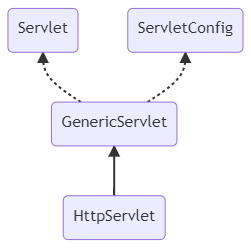
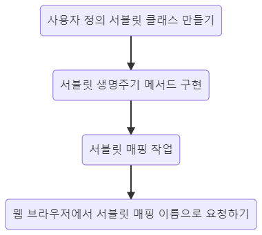

# 서블릿

서블릿은 서버 쪽에서 실행되면서 클라이언트의 요청에 따라 동적으로 서비스를 제공하는 자바 클래스이다.


## 서블릿 특징

- 서버 쪽에서 실행되면서 기능을 수행
- 기존의 정적인 웹 프로그램의 문제점을 보완하여 동적인 여러 가지 기능을 제공
- 스레드 방식으로 실행
- 자바로 만들어져 자바의 특징을 가짐
- 컨테이너에서 실행
- 컨테이너 종류에 상관없음
- 보안 기능을 적용하기 쉬움
- 웹 브라우저에서 요청 시 기능 수행


## 서블릿 API 계층 구조와 기능




| 서블릿 구성 요소         | 기능                                                         |
| ------------------------ | ------------------------------------------------------------ |
| Servlet 인터페이스       | javax.servlet 패키지에 선언되어 있다.<br />Servlet 관련 추상 메서드를 선언한다.<br />init(), service(), destroy(), getServletInfo(), getServletInfo()을 선언한다. |
| ServletConfig 인터페이스 | javax.servlet 패키지에 선언되어 있다.<br />Servlet 관련 추상 메서드 선언되어 있다.<br />init(), service(), destroy(), getServletInfo(), getServletInfo()을 선언되어 있다. |
| GenericServlet 클래스    | javax.servlet 패키지에 선언되어 있다.<br />상위 두 인터페이스를 구현하여 일반적인 서블릿 기능을 구현한 추상 클래스<br />GenericServlet을 상속받아 구현한 사용자 서블릿은 사용되는 프로토콜에 따라 각각 service()를 오버라이딩해서 사용 |
| HttpServlet 클래스       | javax.servlet.http 패키지에 선언되어 있다.<br />GenericServlet을 상속받아 HTTP 프로토콜을 사용하는 웹 브라우저에서 서블릿 기능을 수행<br />웹 브라우저 기반 서비스를 제공하는 서블릿을 만들 때 상속받아 사용<br />요청 시 service()가 호출되면서 요청 방식에 따라 doGet()이나 doPost()가 차례대로 호출된다. |


## 서블릿의 생명주기 메서드

서블릿도 자바 클래스기 때문에 초기화 과정, 메모리에 인스턴스를 생성하여 서비스를 수행한 후 소멸하는 과정을 거친다.

이런 단계를 거칠 때마다 호출되는 콜백 메서드를 서블릿 생명주기 메서드라고 한다.


### :bulb:Tip!

콜백 메서드란 


| 생명주기 단계 | 호출 메서드           | 특징                                                         |
| ------------- | --------------------- | ------------------------------------------------------------ |
| 초기화        | init()                | 서블릿 요청 시 맨 처음 한 번만 호출된다.<br />서블릿 생성 시 초기화 작업을 주로 수행한다. |
| 작업 수행     | doGet()<br />doPost() | 서블릿 요청 시 매번 호출된다.<br />실제로 클라이언트가 요청하는 작업을 수행 |
| 종료          | destroy()             | 서블릿이 기능을 수행하고 메모리에서 소멸될 때 호출<br />서블릿의 마무리 작업을 주로 수행 |

init()과 destroy()는 필요 없다면 생략해도 괜찮지만

doGet()과 doPost()와 같이 do로 시작하는 메서드는 서블릿의 핵심 기능을 처리하므로 반드시 구현해야 한다.


## 서블릿 만들기

다음은 이클립스에서 서블릿을 만들고 실행하는 과정이다.




다른 과정들은 대부분 이클립스에서 거의 자동으로 처리가 가능하지만 서블릿 매핑 작업은 코드를 직접 쳐야 한다.

따라서 서블릿 매핑 작업을 좀 더 자세히 살펴보자.


### 서블릿 매핑하기

브라우저에서 url형식으로 서블릿을 요청하는 방법은 다음과 같다.

`http://IP주소:포트번호/프로젝트이름/패키지이름이 포함된 클래스이름`

하지만 클래스 이름이 길어지게 되면 입력하기가 불편해질 것이다.

또한 클래스 이름을 통해 그 클래스의 기능을 짐작할 수 있기 때문에 보안상의 문제도 생긴다.

그래서 지금은 서블릿 클래스 이름에 대응되는 서블릿 매핑 이름으로 실제 서블릿을 요청한다.


서블릿 매핑 과정은 다음과 같다.

1. 각 프로젝트에 있는 web.xml 파일에서 설정
2. `<servlet>`과 `<servlet-mapping>` 태그 이용


```java
  <servlet>
  	<servlet-name>aaa</servlet-name>
  	<servlet-class>sec01.ex01.Firstservlet</servlet-class>
  </servlet>
  
  <servlet-mapping>
  	<servlet-name>aaa</servlet-name>
  	<url-pattern>/first</url-pattern>
  </servlet-mapping>
```

`<servlet>`태그는 브라우저에서 요청하는 매핑 이름에 대해 실제로 실행하는 서블릿 클래스를 설정하는 태그이다.

`<servlet-name>`태그는 `<servlet-mapping>` 태그에도 공통으로 있는데, 동일한 `<servlet-name>` 태그의 값을 통해 두 태그가 연결된다.

`<serlvet-class>` 태그의 값으로는 패키지 이름이 포함된 서블릿 클래스의 이름을 작성해준다.


`<servlet-mapping>` 태그는 브라우저에서 요청하는 논리적인 서블릿을 설정한다.

`<url-pattern>` 태그의 값으로는 브라우저에서 sec01.ex01.FirstServlet을 요청하는 논리적인 서블릿 이름을 작성한다.


여러 개의 서블릿을 매핑할 경우에는 `<servlet>`과 `<servlet-mapping>` 태그를 분리해서 작성해야 한다.

```java
  <servlet>
  	<servlet-name>aaa</servlet-name>
  	<servlet-class>sec01.ex01.Firstservlet</servlet-class>
  </servlet>
  <servlet>
  	<servlet-name>bbb</servlet-name>
  	<servlet-class>sec01.ex01.Secondservlet</servlet-class>
  </servlet>
-------------------------------- 분리 ----------------------------
  <servlet-mapping>
  	<servlet-name>aaa</servlet-name>
  	<url-pattern>/first</url-pattern>
  </servlet-mapping>
  <servlet-mapping>
      <servlet-name>bbb</servlet-name>
      <url-pattern>/second</url-pattern>
  </servlet-mapping>
```


# :books:참고자료

이병승, 자바 웹을 다루는 기술, 도서출판 길벗, 2019