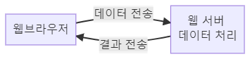
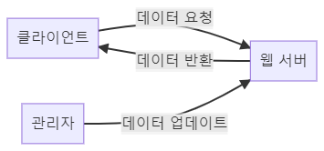

# 웹 프로그램 발전 과정

웹 프로그램은 클라이언트 PC 기반 프로그램에서 시작해 클라이언트 서버 기반 프로그램, 웹 기반 프로그램 순으로 진화해 왔다.

## 클라이언트 PC 기반 프로그램

클라이언트 PC 기반 프로그램은 클라이언트 PC에서 실행하면서 모든 기능을 수행한다.

### 단점

- 인터넷이 나오기 전 PC 기반 프로그램은 기능이나 화면의 형태가 바뀌면 코드를 추가한 후 일일이 다시 PC에 설치하거나 업데이트를 해야함

- 클라이언트 프로그램에 데이터베이스 접속 정보라도 들어 있다면 정보가 쉽게 노출될 수 있기 때문에 보안에 취약함

이러한 클라이언트 PC 기반 프로그램의 문제점을 보완하여 나온 것이 클라이언트-서버 기반 프로그램이다.

## 클라이언트-서버 기반 프로그램

이 구조에서는 기존에 클라이언트가 수행하는 모든 기능을 서버에서 수행한다.

클라이언트는 처리할 데이터가 있으면 네트워크를 통해 서버에 전달하고, 

서버가 처리한 결과를 네트워크를 통해 다시 받아 결과를 화면에 출력하는 역할만 한다.

### 장점

- 기능이 변경되어도 서버에서 처리하면 되기 때문에 클라이언트 프로그램을 수정할 필요가 없음
- 중요한 기능은 서버에서 처리하기 때문에 데이터 보안 측면에서도 클라이언트 PC 기반 프로그램보다 훨씬 우수

### 단점

- 프로그램 화면 변경 시에는 여전히 클라이언트 프로그램도 수정이 필요

## 웹 기반 프로그램

웹 기반 프로그램의 경우 클라이언트는 자신이 사용하는 클라이언트 프로그램을 직접 설치하는 것이 아니라

사용자 컴퓨터의 웹 브라우저를 통해 화면에 해당되는 HTML 문서를 서버에 요청한다.

그러면 서버에서는 요청 받은 HTML 문서를 브라우저에 전송하여 해당 기능을 담당하는 화면을 보여준다.

즉, 사용자가 사용하는 프로그램의 기능이나 화면의 수정을 서버에서 모두 처리할 수 있게 된 것이다.

## 정적 웹 프로그래밍

웹 기반 프로그램을 만드는 데는 정적 웹 프로그래밍과 동적 웹 프로그래밍, 두 가지 방법이 있다.

정적 웹프로그래밍의 특징은 다음과 같다.

### 특징

- 사용자에게 화면 디자인 같은 고정된 정보만 제공
- 정보 수정 시 관리자가 직접 HTML 소스를 수정해서 사용자에게 제공

두 번째 특징에서 정적 웹 프로그래밍의 한계가 명확하게 드러난다.

지금처럼 사용자들에게 제공하는 정보의 변경 속도가 급속도로 빨라지고 있는 현실에서는 관리자가 정보를 실시간으로 수정한다는 건 불가능하다.

## 동적 웹 프로그래밍

정적 웹 프로그래밍의 한계를 극복하기 위해 등장한 것이 동적 웹 프로그래밍이다.

정적 웹 프로그래밍에서 관리자가 수행하던 역할을 동적 웹 프로그래밍에서는 웹 어플리케이션 서버가 대신한다.

웹 어플리케이션 서버는 실시간 정보가 저장되어 있는 데이터베이스에 클라이언트의 요청이 있을 때마다 접근하여 그 정보를 클라이언트에게 제공한다.

## CGI

처음에 동적인 방식으로 프로그램을 제공하던 기능은 CGI(Common Gate Interface)였다.

### 특징

- 초기 웹 프로그램에서 사용하는 방식
- 프로세스 방식으로 실행
- 서버의 부하가 심함

프로세스[^1] 방식이란 클라이언트의 요청이 있을 때마다 그 요청을 처리하기 위한 프로세스를 메모리에 생성해서 수행하는 방식이다.

하지만 이 방식은 같은 프로세스를 수행하더라도 각 경우에 대해 처음부터 메모리에 프로세스를 생성해야만 한다.

요즘과 같이 사용자 수가 많아 동시에 처리해야 할 일이 많은 상황에서는 메모리에 과부하가 걸리기가 쉽다.

이러한 CGI의 문제점을 개선하여 나온 것이 JSP, ASP, PHP와 같은 동적 웹 프로그래밍 기술이다.

## 스레드

### 특징

- 프로세스 방식이 아닌 스레드 방식으로 실행
- 클라이언트의 요구를 처리하는 프로세스는 최초 한 번만 메모리에 로드된다.
- 클라이언트가 동일한 요청을 하면 메모리에 로드한 프로세스를 재사용한다.

프로그램의 수행 속도를 떨어뜨리는 요인 중 하나가 프로그램을 외부 장치에서 메모리로 로드하는 것이다.

스레드 방식으로 수행하면 이 과정을 매번 거치지 않아도 되니 기존의 CGI 프로그램보다 훨씬 빠르게 동작하게 된다.

[^1]: 실행 중인 프로그램은 지칭하는 단어. 프로그램은 보조 기억장치(하드 디스크, SSD)에 존재하며 실행되기를 기다리는 코드와 데이터의 묶음이고, 이 프로그램이 메모리에 적재되면 프로세스가 된다.

