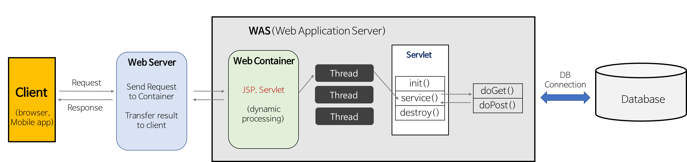

# Web Server, WAS, Web Container

## Web Server

Web Server의 개념은 소프트웨어와 하드웨어로 구분된다.

1. 하드웨어

  Web 서버가 설치되어 있는 컴퓨터

2. 소프트웨어
  웹 브라우저 클라이언트로부터 HTTP 요청을 받아 정적인 컨텐츠(.html .css 등)를 제공하는 컴퓨터 프로그램

ex) Apache, Nginx, IIS, WebtoB 등

## WAS(Web Application Server)

클라이언트의 request(요청)을 받아 DB 조회나, 어떤 로직을 처리해야하는 **동적**인 컨텐츠를 response(응답)하는 서버.

ex) Tomcat, WebLogic, WebSphere, Jeus, JBoss 등

## 둘의 차이점은?

어떤 타입의 컨텐츠(동적, 정적)를 제공하는지가 가장 큰 차이점이다.

Web Server와 WAS는 각각 독립적으로 존재할 수 있다.

대부분의 WAS는 정적인 컨텐츠를 제공해주고 있기 때문에, Web Server 없이 WAS 만 존재할 수 있다.

즉, WAS는 Web Server를 포함하는 개념이라고 할 수 있다.

## Web Server와 WAS를 함께 사용하는 이유?

앞에서 WAS가 Web Server를 포함하는 개념이라고 했다.

그렇다면 굳이 Web Server와 WAS를 사용하는 이유가 무엇일까?

가장 큰 이유는 기능을 분리하여 서버 부하를 막기 위해서이다. 

WAS는 DB 조회나 다양한 로직을 처리하느라 바쁘기 때문에 단순한 정적 컨텐츠는 Web Server에서 빠르게 클라이언트에 제공하는 것이 좋다.

WAS는 기본적으로 동적 컨텐츠를 제공하기 위해 존재하는 서버이다.

만약 정적 컨텐츠 요청까지 WAS가 처리한다면 정적 데이터 처리로 인해 부하가 커지게 되고, 동적 컨텐츠의 처리가 지연됨에 따라 수행 속도가 느려진다.

## Web Container

WAS의 구성요소로 Jsp와 Servlet을 실행시킬 수 있는 소프트웨어를 웹 컨테이너(Web Container)라고 한다.

WAS별로 다양한 종류의 컨테이너를 내장하고 있으며, 이들 중 서블릿에 관련된 기능을 모아 놓은 것을 서블릿 컨테이너라고 부른다.

## Web Service Architecture

웹 서비스는 제공하는 콘텐츠에 따라 다양한 구조로 존재할 수 있다.

그 중에서 Web Server, WAS, Web Container를 모두 포함하고 있는 구조가 어떻게 동작하는지 살펴보자.

1. Web Server는 웹 브라우저 클라이언트로부터 HTTP 요청을 받는다.
2. Web Server는 클라이언트의 요청(Request)을 WAS에 보낸다.
3. WAS는 관련된 Servlet을 메모리에 올린다.
4. WAS는 web.xml을 참조하여 해당 Servlet에 대한 Thread를 생성한다.
5. HttpServletRequest와 HttpServletResponse 객체를 생성하여 Servlet에 전달한다.
   5-1. Thread는 Servlet의 service() 메서드를 호출한다.
   5-2. service() 메서드는 요청에 맞게 doGet() 또는 doPost() 메서드를 호출한다.
6. doGet() 또는 doPost() 메서드는 인자에 맞게 생성된 적절한 동적 페이지를 Response 객체에 담아 WAS에 전달한다.
7. WAS는 Response 객체를 HttpResponse 형태로 바꾸어 Web Server에 전달한다.
8. 생성된 Thread를 종료하고, HttpServletRequest와 HttpServletResponse 객체를 제거한다.

# :books:참고자료

https://denodo1.tistory.com/37 [dBack]

https://gmlwjd9405.github.io/2018/10/27/webserver-vs-was.html

https://doozi316.github.io/web/2020/09/13/WEB26/