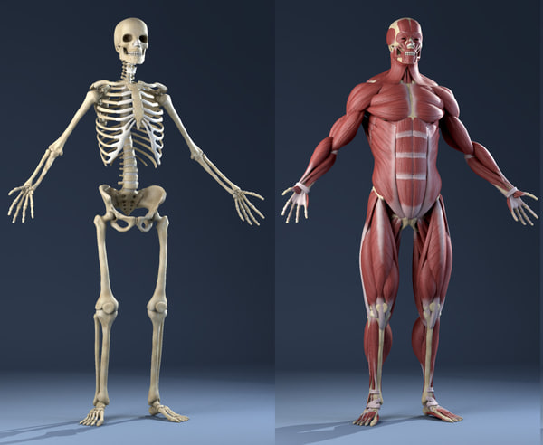

# Web 기초

브라우저를 통해 웹사이트에 들어가면 우리는 형형색색의 콘텐츠들과 마주할 수 있다.

하지만 그 화려함을 걷어내고 보이는 것은 길게 쓰여진 텍스트들뿐이다. 

브라우저는 그 텍스트들을 이해하고 우리가 익숙한 모습의 화면을 만들어준다.

이번에는 텍스트들을 작성하기 위한 규칙들, 웹사이트를 만드는데 필요한 3가지 언어에 대해서 알아보자.


## 1. HTML(HyperText Markup Language)

우리가 웹사이트를 만들기 위해 새로운 언어들을 배워야 하는 이유는 브라우저는 인간의 언어를 이해하지 못하기 때문이다.

첫 번째 언어는 바로 HTML이다.

HTML은 브라우저에게 웹사이트의 콘텐츠가 어떻게 구성되어 있는지 알려줄 때 사용한다.

```html
<h1>이건 제목이야</h1>

<!-- 이건 이미지야-->
<!-- 이런 식으로 브라우저에게 이야기해주어야 한다.-->
```


## 2. CSS(Cascading Style Sheets)

CSS는 HTML과 같이 사용해야만 하는 언어이다.

CSS는 브라우저에게 웹사이트의 콘텐츠가 어떻게 보여야 하는지에 대해서 설명한다. 



좀 더 쉽게 그림을 통해 알아보자.

HTML은 뼈대에, CSS는 그걸 감싸고 있는 근육, 피부 등에 비유할 수 있다.


## 3. JAVASCIPT

웹사이트는 움직이지 않는 사진이 아니다.

유튜브 사이트를 예로 들자면 우리는 보고싶은 비디오를 선택해서 재생시키고, 멈추는 등 수많은 상호작용을 한다.

이를 가능하게 하는 것이 바로 javascript이다. 

HTML이 뼈대, CSS가 근육이라면 javascript는 뇌에 비유할 수 있다.
