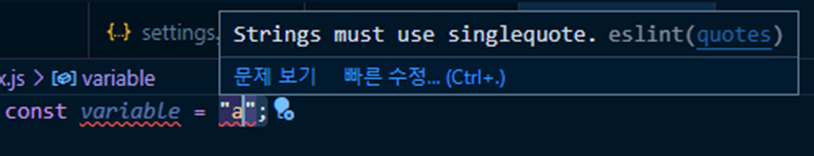

# 개발 생산성을 높여주는 도구

개발에 처음 입문했을 당시,  노마드코더 강의 영상을 통해 Prettier라는 도구에 대해 알게 되었다. 당시에 코린이었던 나에게는 정말 신세계에 들어서는 듯한 경험이었다. 의미없이 탭을 누르고, 스페이스바를 누르던 지겨운 반복작업에서 벗어날 수 있다니!

Prettier를 잘 쓰고 있던 도중, 실무에서는 Eslint와 Prettier를 함께 쓴다는 이야기를 듣게 되었다. 이번에는 두 도구에 대해 좀 더 자세히 알아보고 어떻게 적용시키는지 정리해보려고 한다.

## ESLint

린트(ESLint)는 잘못된 코드 스타일로 인해 에러가 나지 않게 코드 문법을 잡아주는 문법 검사기이다. 문장 뒤에 자동으로 세미콜론, 콤마를 붙여주기도 하고 의미 없는 변수, API 사용에 대해 경고해주는 등 여러 문법 오류에 대해서 미리 알려준다. 가급적 덜 에러가 나는 코드를 작성하면 자연스럽게 버그도 줄어들기 때문에 서비스 품질을 높이는데도 도움이 된다.

## Prettier

프리티어(Prettier)는 코드 스타일을 정리해주는 도구이다. VSCode, Atom, Sublime 등 대중적인 텍스트 편집기에서 이미 플러그인 형태로 지원하고 있으며 VSCode에서는 아래와 같이 확장 플러그인으로 설치할 수 있다.

## 프로젝트에 적용하기

### ESLint 적용하기

#### 설치

ESLint를 사용하기 위해서는 npm으로 설치하는 ESLint 라이브러리와 VS code ESLint extension가 필요하다. 

```bash
npm install eslint --save-dev
```

npm으로 eslint를 설치했으면 VS Code ESLint extension의 부가 설명을 살펴보자.

> Integrates ESLint into VS Code.
> 
> ...
> 
> The extension uses the ESLint library installed in the opened workspace folder. If the folder doesn't provide one the extension looks for a global install version.

VS Code ESLint extension는 단순히 ESLint를 VS Code로 통합시켜주는 역할만 한다. 아래 설명을 읽어보면 해당 워크스페이스 혹은 글로벌로 설치된 ESLint 라이브러리를 사용한다고 되어있다.

결국 npm을 통해 설치된 ESLint 라이브러리를 찾아 VS code와 연결시켜주는 것이다. 그렇기 때문에 처음 말했던 것처럼 ESlint 라이브러리와 extension이 둘 다 필요한 것이다.

#### 설정 파일 만들기

그 다음에는 설정 파일을 만들어야 하는데, 가장 쉬운 방법은 CLI 명령어를 통해 만드는 것이다.

```bash
npm init @eslint/config
```

여러 가지 설정 사항을 입력하면 그에 맞게 설정 파일이 만들어진다.

#### 설정 파일 살펴보기

```json
// .eslintrc.json
{    
    "root": true, 
    "env": {
        "browser": true,
        "es2021": true
    },
    "extends": "eslint:recommended",
    "parserOptions": {
        "ecmaVersion": "latest",
        "sourceType": "module"
    },
    "rules": {
        "semi": ["error", "always"],
        "quotes": ["error", "double"]
    }
}
```

설정파일에 있는 옵션들은 아래의 링크를 확인해보자.

> https://velog.io/@kyusung/eslint-config-2

#### 적용 결과

위에서 single quote를 사용하겠다고 설정했기 때문에 double quotes를 사용하면 다음과 같이 에러 메시지를 확인할 수 있다.

### Prettier 적용하기

Prettier를 적용하는 방법은 2 가지가 있다. 

1. VS Code extension 사용
2. prettier plugin을 설치 후 eslint 설정파일에 세팅

첫 번째 방법은 프로젝트 자체에 prettier 룰을 세팅하는 것이 아니라,  VS Code 에디터 자체에 prettier rule을 세팅하는 것이다. 따라서 내 환경의 VSCode에서만 해당 prettier 방식이 적용되는 것이다.

반대로 2번째는 프로젝트 자체에 prettier rule을 적용한 것으로, 어느 환경에서도 동일한 Prettier rules들을 적용할 수 있는 방법이다.

#### VS Code extension

extension 메뉴에서 Prettier을 검색해 설치해준다. 그리고 .prettierrc, 그러니까 Prettier 설정 파일을 만들어서 안에다 적용시킬 규칙들을 작성해준다. 

```json
{
    "singleQuote": true
}
```

```json
 {
     "editor.formatOnSave": true,
     "editor.defaultFormatter": "esbenp.prettier-vscode",
  }
```

마지막으로는 settings.json 파일에 위 코드를 추가해주자. 위 코드를 추가하는 이유는 다른 extension과 충돌할 가능성에 대비해 기본 포매터를 Prettier로 지정해주는 것이다. 또한 formatOnsave 옵션을 통해 저장할 때마다 자동으로 Prettier가 작동하도록 설정해주었다.

이처럼 extension만으로도 간단하게 Prettier를 사용할 수 있지만 많은 개발자들이 ESLint와 결합하여 프로젝트 설정 파일로 관리하는 것을 추천한다. 왜냐하면 설정 파일로 관리하게 되면 팀원들이 더욱 손쉽게 똑같은 환경에서 작업할 수 있기 때문이다.

#### Plugin 방법

```bash
npm install eslint-plugin-prettier --save-dev 
```

```json
// .eslintrc.json

{
  "plugins": ["prettier"],
  "rules": {
    "prettier/prettier": "error"
  }
}
```

다음과 같이 플러그인을 설치하고 이를 ESLint에 적용시키면 된다.

하지만 이 방법은 포매팅과 관련된 ESLint 규칙이 없을 때 정상적으로 작동한다. 다시 말하면, Prettier의 포매팅 규칙과 ESLint의 포매팅 규칙이 충돌할 수도 있다는 것이다. 따라서 **eslint-config-prettier**를 통해 ESLint 포매팅 규칙들을 모두 비활성화하는 것이 좋다.

```bash
npm install --save-dev eslint-config-prettier
```

```json
{
  "extends": ["plugin:prettier/recommended"]
}
```

위 코드는 아래 코드와 같은 역할을 한다.

```json
{
  "extends": ["prettier"],
  "plugins": ["prettier"],
  "rules": {
    "prettier/prettier": "error",
    "arrow-body-style": "off",
    "prefer-arrow-callback": "off"
  }
} 
```

**"extends": ["prettier"]**

eslint-config-prettier의 설정을 적용시켜 Prettier와 충돌하는 ESLint 규칙들을 비활성화한다.

**"plugins": ["prettier"]**

prettier 플러그인을 등록한다.

**"prettier/prettier": "error"**

ESLint에 Prettier 플러그인에서 제공하는 규칙들을 추가해 해당 규칙들에 어긋날 경우 에러 메시지를 띄운다.

**"arrow-body-style": "off" & "prefer-arrow-callback": "off"**

Prettier 플러그인과 문제가 발생하는 ESLint의 두 가지 규칙을 비활성화한다. 이렇게 비활성화하는 이유는 Prettier와 위 두 개의 규칙을 함께 사용할 경우 ESLint의 자동 수정 기능와 관련된 버그때문에 코드가 잘못될 수 있다.

## 마무리

정리하자면 ESLint가 에러가 발생하지 않도록 문법을 잡아준다면, Prettier는 이름 그대로 이쁜 코드를 작성하는 걸 도와주는 도구이다.

앞에서 살펴본 Prettier plugin 방식을 사용하면 ESLint와 Prettier 두 가지를 함께 사용할 수 있게 된다. 이렇게 되면 에러를 미연에 방지할 수 있을 뿐만 아니라 깔끔하고 이쁘기까지 한 코드를 작성할 수 있게 되는 것이다. 

# :books:참고자료

https://joshua1988.github.io/web-development/vuejs/boost-productivity/

 [ESLint, Prettier Setting, 헤매지 말고 정확히 알고 설정하자. :: 이뇽의세상](https://helloinyong.tistory.com/325)

[GitHub - prettier/eslint-plugin-prettier: ESLint plugin for Prettier formatting](https://github.com/prettier/eslint-plugin-prettier#recommended-configuration)

[Getting Started with ESLint - ESLint - Pluggable JavaScript linter](https://eslint.org/docs/user-guide/getting-started)
